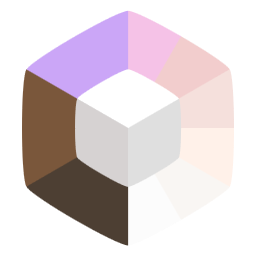

# RayLauncher

  

  <b>Le launcher Minecraft sans prise de tête pour toi et tes potes.</b> 
  Un fork de <a href="https://github.com/FreesmTeam/FreesmLauncher">Freesm Launcher</a> (lui-même fork de <a href="https://prismlauncher.org">Prism Launcher</a>) — GPL-3.0-only

---

## C'est quoi ?

**RayLauncher** est un launcher Minecraft fait par [**Rayou** (RayanLhrd)](https://github.com/RayanLhrd) pour ses potes.

L'idée : plus besoin de bidouiller avec AppData, CurseForge ou Modrinth pour installer un modpack. Tu ouvres le launcher, tu vois directement **tous les modpacks de Rayou** en tuiles, tu cliques **Installer**, tu cliques **Jouer**, tu joues.

Quand Rayou push une mise à jour d'un modpack (nouveaux mods, configs, resource packs), un **bouton Mettre à jour** apparaît sur ta tuile. Un clic et tout est resynchronisé — tes **touches custom, FOV, sensibilité souris et autres préférences perso sont préservées**.

## Principales features

- 🎮 **Catalogue de modpacks intégré** — tous les packs de Rayou affichés en tuiles cliquables au lancement. Un clic = installation, re-clic = Jouer. Zéro config.
- 🔄 **Mises à jour en un clic** — quand Rayou push, tu vois un badge et un bouton Mettre à jour. Les fichiers du pack sont remplacés, tes préférences perso restent.
- 🔐 **Compte Microsoft ou offline** — pas besoin de compte Premium pour jouer en LAN ou sur les serveurs du groupe.
- 🪟 **Fenêtre 16:9 par défaut, interface en français**, sans bazars de tabs/toolbars superflus. Tout passe par la grille de tuiles.
- 🗑️ **Protection des modpacks officiels** — tu peux supprimer tes instances perso, mais les modpacks du catalogue sont protégés contre la suppression accidentelle.
- 🖼️ **Animated cat packs, snow, screenshot dans le presse-papier** — hérités de FreesmLauncher.

## Installation

1. Télécharge `RayLauncher-Setup.exe` depuis la page [Releases](https://github.com/RayanLhrd/RayLauncher/releases) (ou depuis la dernière build [Actions](https://github.com/RayanLhrd/RayLauncher/actions)).
2. Double-clique. Windows SmartScreen va râler parce que l'exe n'est pas signé — clique **Informations complémentaires → Exécuter quand même**. C'est normal.
3. Coche la case Desktop Shortcut si tu veux le raccourci sur le bureau.
4. Lance RayLauncher, ajoute ton compte Minecraft (Microsoft ou Offline), et c'est parti.

## Pour les potes, comment ça marche en pratique

1. Tu installes une fois RayLauncher.
2. Au lancement, tu vois les modpacks de Rayou en tuiles carrées.
3. Clic **Installer** sur le pack que tu veux → barre de téléchargement.
4. Clic **Jouer** → Minecraft se lance, pas d'étape à configurer, tout est déjà prêt.
5. Un jour où Rayou a push une update : badge sur la tuile → clic **Mettre à jour** → tes touches custom sont gardées, le reste est rafraîchi.

## Crédits

RayLauncher est un fork en cascade :

- **[RayLauncher](https://github.com/RayanLhrd/RayLauncher)** — rebrand + système de catalogue modpacks curé, par **Rayou**.
- **[FreesmLauncher](https://github.com/FreesmTeam/FreesmLauncher)** — offline mode, Ely.by / authlib-injector, cat packs animés.
- **[Prism Launcher](https://prismlauncher.org)** — la base moderne, fork de MultiMC.
- **[MultiMC](https://multimc.org)** — l'ancêtre, 2013.

Merci aux équipes en amont. RayLauncher est distribué sous **GPL-3.0-only**, comme tous ses ancêtres.

## Limites (à savoir)

- L'exe est **non signé** — ton Windows va râler au premier lancement. Aucune malice, juste pas de certificat Code-Signing (ça coûte ~200 €/an, pas pertinent pour distribution à des potes).
- Pour l'instant pas de build macOS / Linux automatique (le workflow CI se concentre sur Windows x64 MSVC). Un fork motivé peut les rétablir.
- Les modpacks du catalogue sont publics sur [RayanLhrd/raylauncher-modpacks](https://github.com/RayanLhrd/raylauncher-modpacks) — pas de protection sur qui peut les télécharger, uniquement sur qui peut les publier.

## Questions / bug

Ouvre une [issue](https://github.com/RayanLhrd/RayLauncher/issues) ou ping directement Rayou.
