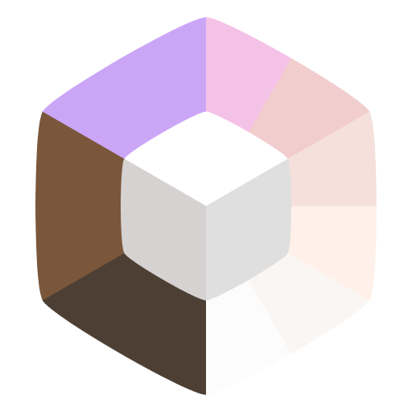
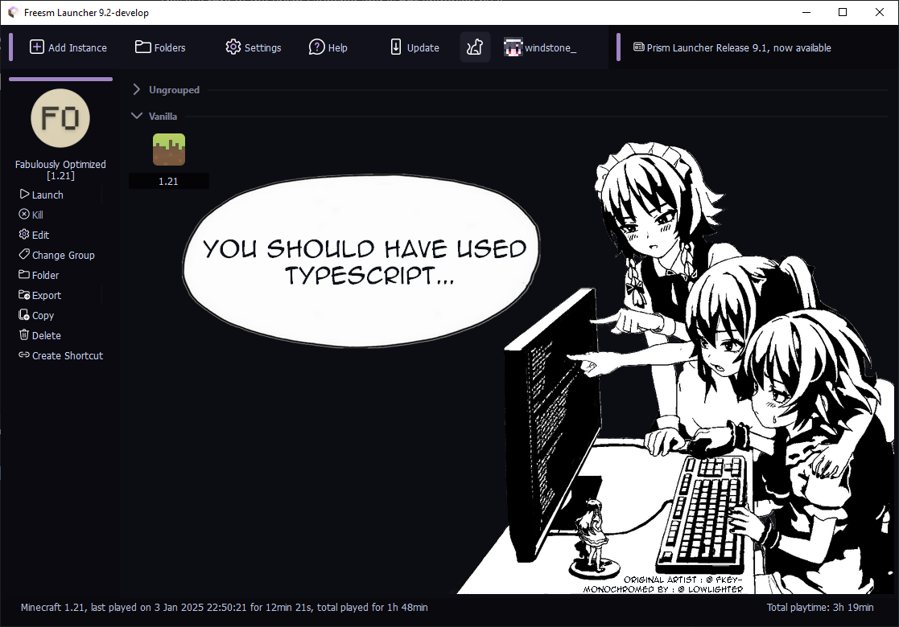
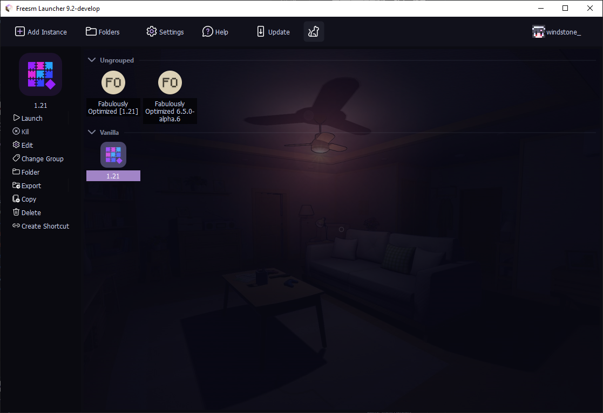
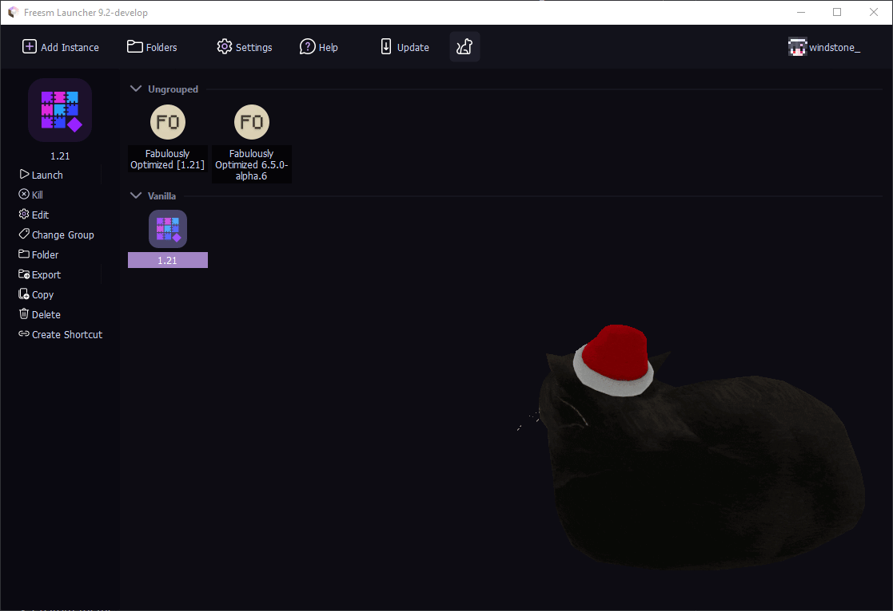
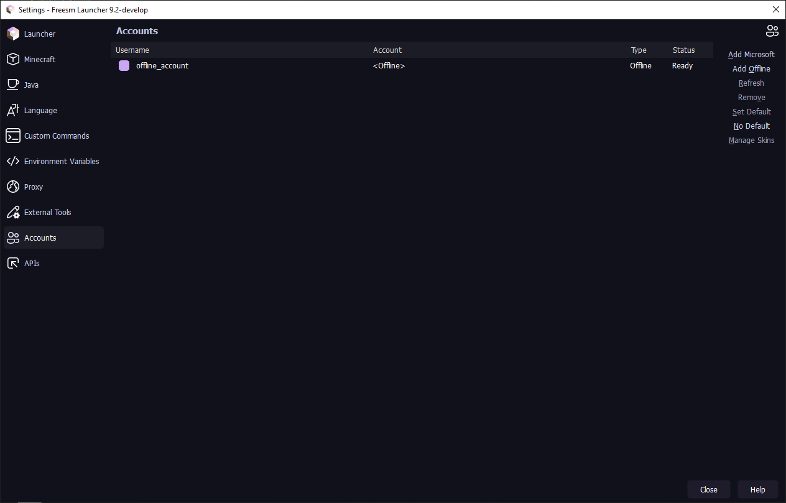
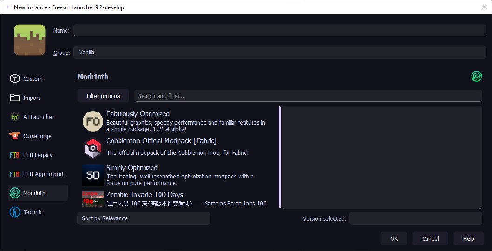
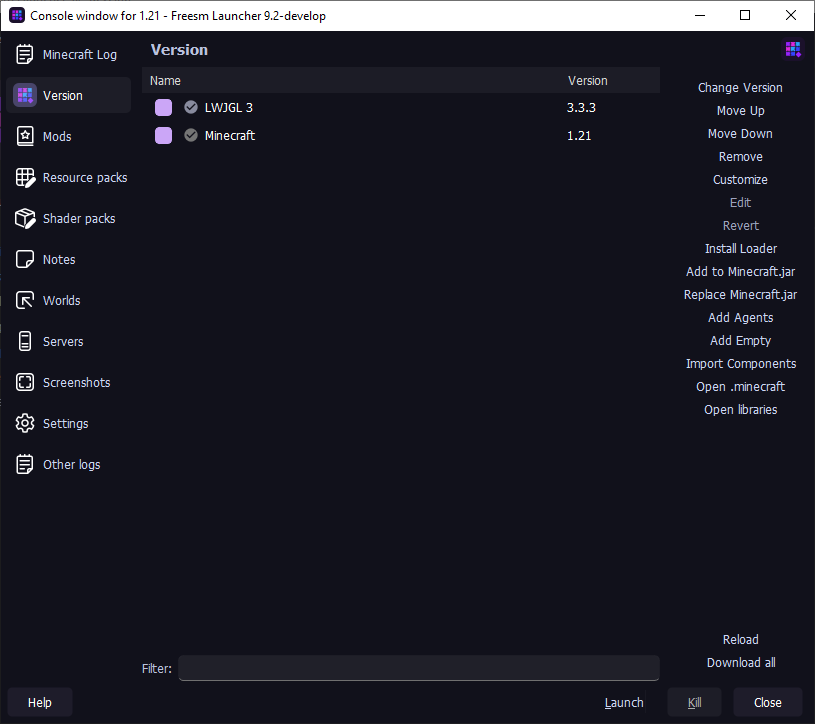
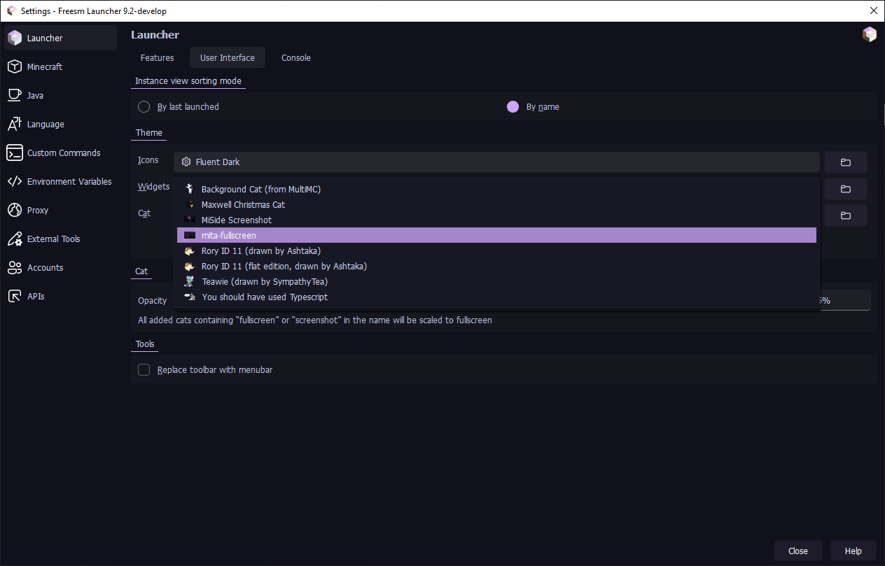

<h1>
<a style="color:#f5c2e7" href="https://freesmlauncher.org/">Freesm Launcher</a>
</h1>

Форк Prism Launcher'а, который **позволяет играть с офлайн-аккаунтом без ограничений**, поддерживает кастомные сервера авторизации и расширяет кастомизацию

Этот форк **не** поддерживается Prism Launcher'ом

Основан на Prism Launcher **10.0.2**

<a style="color:#f5c2e7" href="./README.md">English</a> | <strong>Русский</strong>

## Скриншоты

  
Показать

  

    

      
      
      
      
      
      
      
      
    

  

## Возможности

- Офлайн-аккаунт больше не требует наличия лицензии
- Возможность входа через [Ely.by](https://ely.by/). Скины будут показываться не только на серверах с плагином Ely.by, но и в синглплеере/на серверах без плагина
- Поддержка кастомных серверов авторизации
- Темная и светлая темы на основе [Fluent-Dark](https://github.com/PrismLauncher/Themes/tree/main/themes/Fluent-Dark) с цветами [catppuccin](https://catppuccin.com/)/[rosé pine](https://rosepinetheme.com/) и иконками [Microsoft Fluent](https://fluent2.microsoft.design/iconography)
- Поддержка анимированных GIF cat паков и image crop
- Поддержка автоматического копирования скриншотов из игры в буфер обмена без модов
- Анимированный эффект снегопада
- Выбор случайных никнеймов и иконок для сборок
- FLOSS
- ...все остальные фичи Prism Launcher'а

## Сравнение

| Feature                                           | Freesm  Launcher | Shattered  Prism | HMCL | Fjord   | PollyMC       | ElyPrism      | UltimMC | Prism-Cracked | Prism Launcher |
|---------------------------------------------------|------------------|------------------|------|---------|---------------|---------------|---------|---------------|----------------|
| Офлайн-игра без аккаунта Microsoft                | ✅                | ✅                | ✅    | ❌       | ✅             | ✅             | ✅       | ✅             | ❌              |
| FTB сборки                                        | ✅                | ✅                | ❌    | ✅       | ✅             | ✅             | ❌       | ✅             | ✅              |
| Поддержка Ely.by                                  | ✅                | 🟨¹              | 🟨¹  | 🟨¹     | 🟨¹           | ✅             | 🟨¹     | ❌             | ❌              |
| Поддержка Authlib-injector                        | ✅                | ✅                | ✅    | ✅       | ✅             | ✅             | ❌²      | ❌²            | ❌²             |
| Поддержка кастомного Authlib-injector jar         | ❌²               | ✅                | ❌²   | ✅       | ❌²            | ❌²            | ❌²      | ❌²            | ❌²             |
| Анимированные Cat паки & кадрирование изображения | ✅                | ❌                | ❌    | ❌       | ❌             | ❌             | ❌       | ❌             | ❌              |
| Копирование скриншотов из игры в буфер обмена     | ✅                | ❌                | ❌    | ❌       | ❌             | ❌             | ❌       | ❌             | ❌              |
| Форк                                              | PrismLauncher    | FjordLauncher    | ❌    | PollyMC | PrismLauncher | PrismLauncher | MultiMC | PrismLauncher | PolyMC         |

¹ не использует официальные Ely.by authlib патчи

² можно изменить JVM аргумент `javaagent` так, чтобы он использовал Ваш файл `authlib-injector` как сервер авторизации

## Установка

### Стабильные версии

Скачайте Freesm Launcher с нашего [официального сайта](https://freesmlauncher.org/) или через страницу [GitHub Releases](https://github.com/FreesmTeam/FreesmLauncher/releases). Лаунчер доступен на **Linux, Windows и macOS**.

Для пользователей NixOS доступен [Flake](https://github.com/FreesmTeam/FreesmLauncher/tree/develop/nix).

### Нестабильные сборки

Имейте в виду, что эти сборки могут содержать ошибки и быть нестабильными. Мы не рекомендуем использовать их в большинстве случаев.

Доступные нестабильные сборки могут быть получены через:

* [GitHub Actions](https://github.com/FreesmTeam/FreesmLauncher/actions) (также включает сборки из pull-реквестов контрибьюторов).
* [nightly.link](https://nightly.link/FreesmTeam/FreesmLauncher/workflows/trigger_builds/develop) (ссылка всегда будет указывать на последнюю версию ветки `develop`).

Эти сборки содержат отладочную информацию, поэтому их размер будет относительно больше. Уже готовые нестабильные сборки доступны на **Linux, Windows и macOS**.

## Сообщество и поддержка

Если Вы нашли баг или хотите сделать какое-либо предложение, пожалуйста, откройте issue в [GitHub Issues](https://github.com/FreesmTeam/FreesmLauncher/issues). Pull-реквесты и любой вклад (code, docs, translations) приветствуются!

### Discord

### Telegram

### Subreddit

## Переводы

Freesm Launcher использует переводы Prism Launcher'а на данный момент.

Переводы Prism Launcher хостятся на Weblate и вся информация об этом находится на https://github.com/PrismLauncher/Translations.

<!-- Freesm Launcher supports community translations via [Weblate](https://hosted.weblate.org/projects/freesmlauncher/). Help us translate or improve existing translations by visiting our [Weblate page](https://hosted.weblate.org/projects/freesmlauncher/) or our [GitHub Translations guide](https://github.com/FreesmTeam/Translations). -->

## Сборка

Если вы хотите собрать Freesm Launcher самостоятельно, следуйте [инструкциям сборки Prism Launcher](https://prismlauncher.org/wiki/development/build-instructions/) (Freesm использует систему сборки Garnix).

## Прочее

<ul>
  <li>Мы <strong>НЕ</strong> связаны с командой <a href="https://prismlauncher.org">Prism Launcher</a>.</li>
  <li>Мы <strong>НЕ</strong> собираем вашу информацию. Не верите? Проверьте сами.</li>
  <li>Мы <strong>ПРЕДОСТАВЛЯЕМ</strong> возможность играть в Minecraft бесплатно.</li>
  <li>Мы <strong>ОТКРЫТЫ</strong> для коммитов от сообщества.</li>
</ul>

## Лицензия

